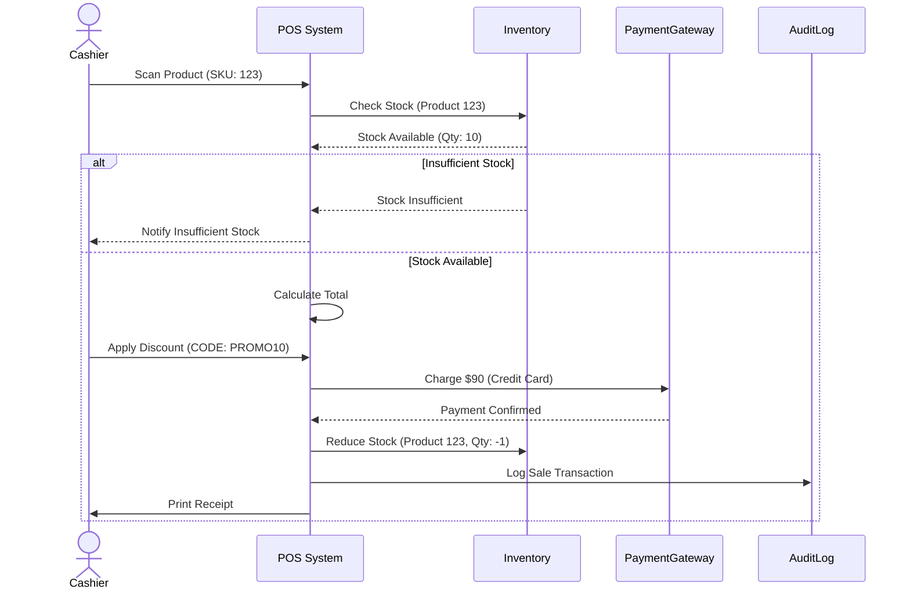
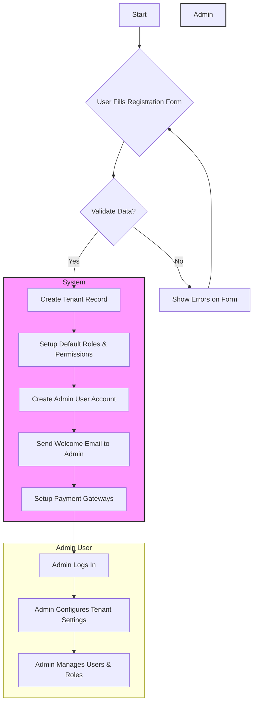
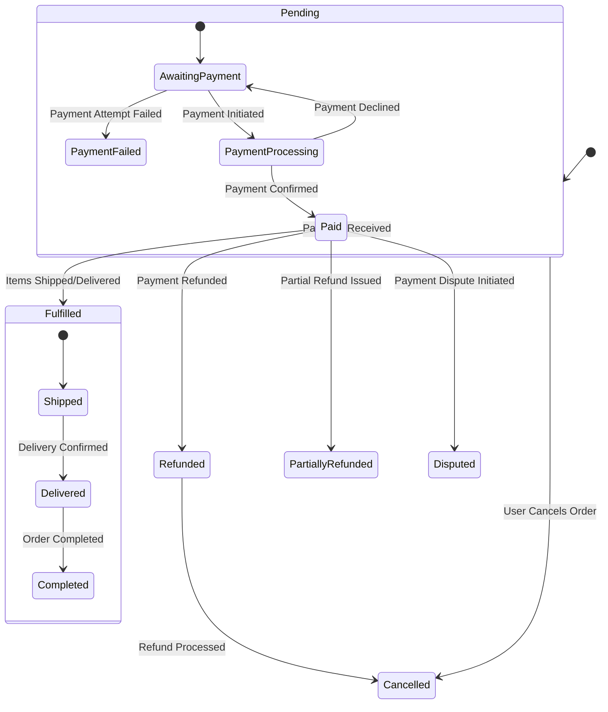

# POS SaaS System

## Entity Relationship Diagram

```mermaid
erDiagram
    %% 1. Tenant & Subscription Management
    tenants {
        uuid id PK
        string name
        string subdomain
        uuid plan_id FK
        INDEX(name)
    }

    subscriptions {
        uuid id PK
        uuid tenant_id FK
        uuid plan_id FK
        string status
        timestamp start_date
        timestamp end_date
        INDEX(tenant_id)
        INDEX(plan_id)
    }

    subscription_plans {
        uuid id PK
        string name
        decimal price
        json features
    }

    %% 2. User & RBAC
    users {
        uuid id PK
        uuid tenant_id FK
        string email
        string password_hash
        timestamp created_at
        timestamp last_login
        string status
        INDEX(tenant_id)
        INDEX(email)
    }

    roles {
        uuid id PK
        uuid tenant_id FK
        string name
        json permissions
        INDEX(tenant_id)
    }

    user_roles {
        uuid user_id PK, FK
        uuid role_id PK, FK
    }

    permissions {
        uuid id PK
        string name
        string description
        uuid tenant_id FK
        INDEX(tenant_id)
    }

    %% 3. Product & Inventory
    products {
        uuid id PK
        uuid tenant_id FK
        string sku
        string name
        decimal price
        decimal cost_price
        string unit_of_measure
        INDEX(tenant_id)
        INDEX(sku)
    }

    categories {
        uuid id PK
        uuid tenant_id FK
        string name
        uuid parent_id FK "Hierarchical category"
        INDEX(tenant_id)
    }

    product_categories {
        uuid product_id PK, FK
        uuid category_id PK, FK
    }

    inventory {
        uuid id PK
        uuid tenant_id FK
        uuid product_id FK
        integer stock
        string location
        INDEX(tenant_id)
        INDEX(product_id)
    }

    inventory_logs {
        uuid id PK
        uuid inventory_id FK
        integer quantity
        string action_type "restock/sale/adjustment"
        timestamp created_at
        INDEX(inventory_id)
    }

    suppliers {
        uuid id PK
        uuid tenant_id FK
        string name
        string contact
        INDEX(tenant_id)
    }

    %% 4. Sales & Payment
    sales {
        uuid id PK
        uuid tenant_id FK
        uuid user_id FK
        decimal total_amount
        timestamp created_at
        INDEX(tenant_id)
        INDEX(user_id)
    }

    sale_items {
        uuid id PK
        uuid sale_id FK
        uuid product_id FK
        integer quantity
        decimal unit_price
        decimal discount_amount
        INDEX(sale_id)
        INDEX(product_id)
    }

    payments {
        uuid id PK
        uuid sale_id FK
        string method "cash/card/ewallet"
        decimal amount
        string transaction_id
        INDEX(sale_id)
    }

    taxes {
        uuid id PK
        uuid tenant_id FK
        string name
        decimal rate
        INDEX(tenant_id)
    }

    discounts {
        uuid id PK
        uuid tenant_id FK
        string code
        decimal value
        string type "percentage/fixed"
        INDEX(tenant_id)
    }

    %% 5. Customer & Loyalty
    customers {
        uuid id PK
        uuid tenant_id FK
        string name
        string phone
        string email
        INDEX(tenant_id)
    }

    loyalty_programs {
        uuid id PK
        uuid tenant_id FK
        string name
        decimal points_rate "Points per currency"
        INDEX(tenant_id)
    }

    loyalty_points {
        uuid id PK
        uuid customer_id FK
        integer balance
        INDEX(customer_id)
    }

    %% 6. Reporting & Logs
    audit_logs {
        uuid id PK
        uuid tenant_id FK
        uuid user_id FK
        string action
        timestamp created_at
        INDEX(tenant_id)
        INDEX(user_id)
    }

    reports {
        uuid id PK
        uuid tenant_id FK
        string type
        json data
        INDEX(tenant_id)
    }

    %% 7. Integrations & Settings
    payment_gateways {
        uuid id PK
        uuid tenant_id FK
        string type "stripe/midtrans"
        string api_key_encrypted
        INDEX(tenant_id)
    }

    tenant_settings {
        uuid id PK
        uuid tenant_id FK
        string setting_key
        string setting_value
        INDEX(tenant_id)
    }

    %% Relationships
    tenants ||--o{ subscriptions : "has"
    subscription_plans ||--o{ subscriptions : "offers"
    tenants ||--o{ users : "has"
    tenants ||--o{ roles : "defines"
    users }|--|| roles : "assigned_via"
    roles }|--|{ permissions : "has"

    tenants ||--o{ products : "owns"
    products }|--|{ categories : "categorized_via"
    categories }|--|| categories : "child_of"
    products ||--o{ inventory : "tracks"
    inventory ||--o{ inventory_logs : "logs"
    suppliers }o--|| products : "supplies"

    tenants ||--o{ sales : "has"
    sales ||--o{ sale_items : "contains"
    sale_items }o--|| products : "references"
    discounts ||--o{ sale_items : "applies to"
    sales }|--|| payments : "processed_via"
    sales }|--|| taxes : "applies"
    sales }|--|| discounts : "applies"

    tenants ||--o{ customers : "has"
    customers }|--|| loyalty_points : "earns"
    loyalty_programs ||--o{ loyalty_points : "governs"

    tenants ||--o{ audit_logs : "logs"
    tenants ||--o{ reports : "generates"
    tenants ||--o{ payment_gateways : "configures"
    tenants ||--o{ tenant_settings : "configures"
```

## Entities Detail

-   **Tenants**: Represents a business or organization using the POS system. Stores information like name, subdomain, and associated subscription plan.
-   **Subscriptions**: Manages tenant subscription details, including the plan, status, and duration.
-   **Subscription Plans**: Defines different subscription tiers with varying features and pricing. Includes resource limits (e.g., number of users, storage space) in the `features` JSON.
-   **Users**: Stores user account information, including email, password_hash, associated tenant, creation timestamp, last login, and status (active, inactive, locked).
-   **Roles**: Defines user roles within a tenant, controlling access and permissions.
-   **User Roles**: Maps users to specific roles, granting them the associated permissions.
-   **Permissions**: Defines specific actions or access rights within the system, specific to a tenant.
-   **Products**: Represents items available for sale, including SKU, name, price, cost price, and unit of measure.
-   **Categories**: Organizes products into hierarchical categories for easier management.
-   **Product Categories**: Maps products to specific categories.
-   **Inventory**: Tracks product stock levels and locations.
-   **Inventory Logs**: Records inventory changes, such as restocks, sales, and adjustments.
-   **Suppliers**: Manages supplier information for product sourcing.
-   **Sales**: Represents sales transactions, including total amount, associated user, and timestamp.
-   **Sale Items**: Lists individual items included in a sale, with quantity, unit price and discount amount if any.
-   **Payments**: Records payment details for sales transactions, including method, amount, and transaction ID.
-   **Taxes**: Defines tax rates applicable to sales.
-   **Discounts**: Manages discount codes and their values (percentage or fixed).
-   **Customers**: Stores customer information, including name, phone, and email.
-   **Loyalty Programs**: Defines loyalty programs and points earned per currency spent.
-   **Loyalty Points**: Tracks customer loyalty points balance.
-   **Audit Logs**: Records user actions and system events, including the associated tenant and user, for auditing purposes.
-   **Reports**: Generates various system reports and analytics.
-   **Payment Gateways**: Configures payment gateway integrations (e.g., Stripe, Midtrans).
-   **Tenant Settings**: Stores tenant-specific settings and configurations.

## Sequence Diagram



## Activity Diagram: User Registration



## State Diagram: Order Management



## Suggestions and Best Practices

1.  **General Best Practices**:
    *   **Data Validation**: Implement robust data validation at every layer of your application to prevent data integrity issues.
    *   **Security**: Follow security best practices, including encryption of sensitive data, protection against SQL injection and XSS attacks, and secure authentication and authorization mechanisms.
    *   **Scalability**: Design your system with scalability in mind, considering factors such as database sharding, caching, and load balancing.
    *   **Monitoring and Logging**: Implement comprehensive monitoring and logging to track system performance, identify issues, and facilitate debugging.
    *   **Disaster Recovery**: Have a disaster recovery plan in place to ensure business continuity in the event of a system failure.
2.  **Additional Diagrams (Optional)**:
    *   **Deployment Diagram**: Illustrates the physical deployment of your application components.
    *   **Component Diagram**: Shows the high-level components of your system and their relationships.
