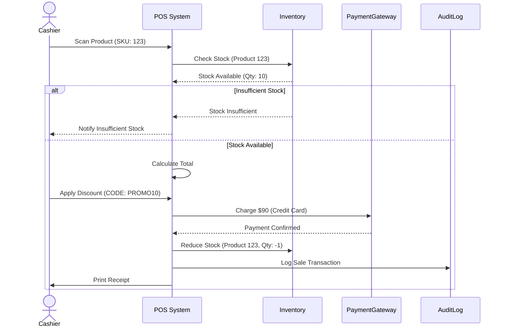
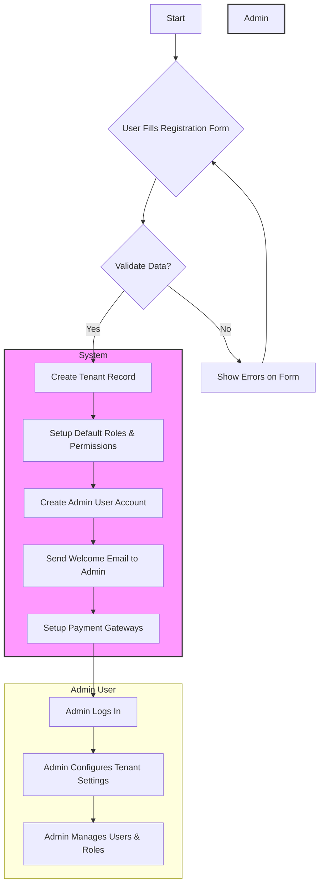
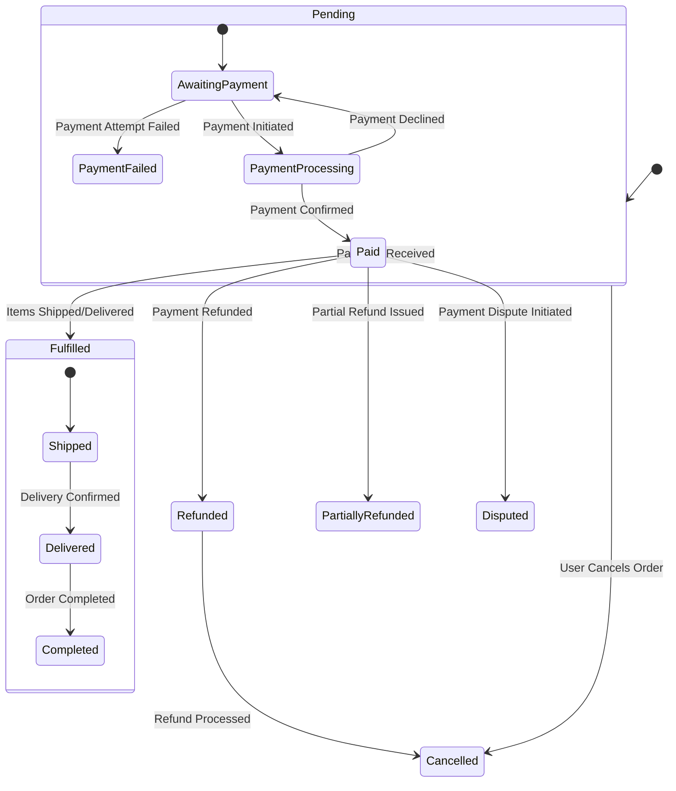

# POS SaaS System

## Entity Relationship Diagram

```mermaid
erDiagram
    tenants {
        uuid id PK
        string name
        string subdomain
        uuid plan_id FK
    }
    subscriptions {
        uuid id PK
        uuid tenant_id FK
        uuid plan_id FK
        string status
        timestamp start_date
        timestamp end_date
    }
    subscription_plans {
        uuid id PK
        string name
        decimal price
        json features
    }
    users {
        uuid id PK
        uuid tenant_id FK
        string email
        string password_hash
        timestamp created_at
        timestamp last_login
        string status
    }
    roles {
        uuid id PK
        uuid tenant_id FK
        string name
        json permissions
    }
    role_permissions {
        uuid role_id FK
        uuid permission_id FK
    }
    user_roles {
        uuid user_id FK
        uuid role_id FK
    }
    permissions {
        uuid id PK
        string name
        string description
        uuid tenant_id FK
    }
    products {
        uuid id PK
        uuid tenant_id FK
        string sku
        string name
        decimal price
        decimal cost_price
        string unit_of_measure
        uuid supplier_id FK
    }
    categories {
        uuid id PK
        uuid tenant_id FK
        string name
        uuid parent_id FK "Hierarchical category"
    }
    product_categories {
        uuid product_id FK
        uuid category_id FK
    }
    inventory {
        uuid id PK
        uuid tenant_id FK
        uuid product_id FK
        integer stock
        string location
    }
    inventory_logs {
        uuid id PK
        uuid inventory_id FK
        integer quantity
        string action_type "restock/sale/adjustment"
        timestamp created_at
    }
    suppliers {
        uuid id PK
        uuid tenant_id FK
        string name
        string contact
    }
    sales {
        uuid id PK
        uuid tenant_id FK
        uuid user_id FK
        decimal total_amount
        timestamp created_at
        uuid tax_id FK
        uuid discount_id FK
    }
    sale_items {
        uuid id PK
        uuid sale_id FK
        uuid product_id FK
        integer quantity
        decimal unit_price
        decimal discount_amount
    }
    payments {
        uuid id PK
        uuid sale_id FK
        string method "cash/card/ewallet"
        decimal amount
        string transaction_id
    }
    taxes {
        uuid id PK
        uuid tenant_id FK
        string name
        decimal rate
    }
    discounts {
        uuid id PK
        uuid tenant_id FK
        string code
        decimal value
        string type "percentage/fixed"
    }
    customers {
        uuid id PK
        uuid tenant_id FK
        string name
        string phone
        string email
    }
    loyalty_programs {
        uuid id PK
        uuid tenant_id FK
        string name
        decimal points_rate "Points per currency"
    }
    loyalty_points {
        uuid id PK
        uuid customer_id FK
        integer balance
        uuid loyalty_program_id FK
    }
    audit_logs {
        uuid id PK
        uuid tenant_id FK
        uuid user_id FK
        string action
        timestamp created_at
    }
    reports {
        uuid id PK
        uuid tenant_id FK
        string type
        json data
    }
    payment_gateways {
        uuid id PK
        uuid tenant_id FK
        string type "stripe/midtrans"
        string api_key_encrypted
    }
    tenant_settings {
        uuid id PK
        uuid tenant_id FK
        string setting_key
        string setting_value
    }
     INDEX tenants name
     INDEX subscriptions tenant_id
     INDEX subscriptions plan_id
     INDEX users tenant_id
     INDEX users email
     INDEX roles tenant_id
     INDEX permissions tenant_id
     INDEX products tenant_id
     INDEX products sku
     INDEX categories tenant_id
     INDEX inventory tenant_id
     INDEX inventory product_id
     INDEX inventory_logs inventory_id
     INDEX suppliers tenant_id
     INDEX sales tenant_id
     INDEX sales user_id
     INDEX sale_items sale_id
     INDEX sale_items product_id
     INDEX customers tenant_id
     INDEX loyalty_points customer_id
     INDEX audit_logs tenant_id
     INDEX audit_logs user_id
     INDEX reports tenant_id
     INDEX payment_gateways tenant_id
     INDEX tenant_settings tenant_id

    tenants ||--o{ subscriptions : "has"
    subscription_plans ||--o{ subscriptions : "offers"
    tenants ||--o{ users : "has"
    tenants ||--o{ roles : "defines"
    users }|--|| user_roles : "assigned_via"
    roles }|--|| user_roles : "assigned_via"
    roles }|--|{ role_permissions : "has"
    permissions }|--|{ role_permissions : "assigned_via"
    tenants ||--o{ products : "owns"
    suppliers }o--|| products : "supplies"
    products }|--|{ categories : "categorized_via"
    categories ||--|| categories : "child_of"
    products ||--o{ inventory : "tracks"
    inventory ||--o{ inventory_logs : "logs"

    tenants ||--o{ sales : "has"
    sales ||--o{ sale_items : "contains"
    sale_items }o--|| products : "references"
    discounts ||--o{ sale_items : "applies to"
    sales }|--|| payments : "processed_via"
    sales }o--|| taxes : "applies"
    sales }o--|| discounts : "applies"

    tenants ||--o{ customers : "has"
    customers }|--|| loyalty_points : "earns"
    loyalty_programs ||--o{ loyalty_points : "governs"

    tenants ||--o{ audit_logs : "logs"
    tenants ||--o{ reports : "generates"
    tenants ||--o{ payment_gateways : "configures"
    tenants ||--o{ tenant_settings : "configures"
```



## Entities Detail

-   **Tenants**: Represents a business or organization using the POS system. Stores information like name, subdomain, and associated subscription plan.
-   **Subscriptions**: Manages tenant subscription details, including the plan, status, and duration.
-   **Subscription Plans**: Defines different subscription tiers with varying features and pricing. Includes resource limits (e.g., number of users, storage space) in the `features` JSON.
-   **Users**: Stores user account information, including email, password_hash, associated tenant, creation timestamp, last login, and status (active, inactive, locked).
-   **Roles**: Defines user roles within a tenant, controlling access and permissions.
-   **User Roles**: Maps users to specific roles, granting them the associated permissions.
-   **Permissions**: Defines specific actions or access rights within the system, specific to a tenant.
-   **Products**: Represents items available for sale, including SKU, name, price, cost price, and unit of measure.
-   **Categories**: Organizes products into hierarchical categories for easier management.
-   **Product Categories**: Maps products to specific categories.
-   **Inventory**: Tracks product stock levels and locations.
-   **Inventory Logs**: Records inventory changes, such as restocks, sales, and adjustments.
-   **Suppliers**: Manages supplier information for product sourcing.
-   **Sales**: Represents sales transactions, including total amount, associated user, and timestamp.
-   **Sale Items**: Lists individual items included in a sale, with quantity, unit price and discount amount if any.
-   **Payments**: Records payment details for sales transactions, including method, amount, and transaction ID.
-   **Taxes**: Defines tax rates applicable to sales.
-   **Discounts**: Manages discount codes and their values (percentage or fixed).
-   **Customers**: Stores customer information, including name, phone, and email.
-   **Loyalty Programs**: Defines loyalty programs and points earned per currency spent.
-   **Loyalty Points**: Tracks customer loyalty points balance.
-   **Audit Logs**: Records user actions and system events, including the associated tenant and user, for auditing purposes.
-   **Reports**: Generates various system reports and analytics.
-   **Payment Gateways**: Configures payment gateway integrations (e.g., Stripe, Midtrans).
-   **Tenant Settings**: Stores tenant-specific settings and configurations.

## Sequence Diagram



## Activity Diagram: User Registration



## State Diagram: Order Management



## Suggestions and Best Practices

1.  **General Best Practices**:
    *   **Data Validation**: Implement robust data validation at every layer of your application to prevent data integrity issues.
    *   **Security**: Follow security best practices, including encryption of sensitive data, protection against SQL injection and XSS attacks, and secure authentication and authorization mechanisms.
    *   **Scalability**: Design your system with scalability in mind, considering factors such as database sharding, caching, and load balancing.
    *   **Monitoring and Logging**: Implement comprehensive monitoring and logging to track system performance, identify issues, and facilitate debugging.
    *   **Disaster Recovery**: Have a disaster recovery plan in place to ensure business continuity in the event of a system failure.
2.  **Additional Diagrams (Optional)**:
    *   **Deployment Diagram**: Illustrates the physical deployment of your application components.
    *   **Component Diagram**: Shows the high-level components of your system and their relationships.

## Panduan Database Migration

Aplikasi ini menggunakan Entity Framework Core untuk mengelola database dan migrasi. Berikut adalah panduan lengkap untuk melakukan operasi database menggunakan script yang tersedia.

### Prasyarat

1. Pastikan PostgreSQL sudah terinstall dan berjalan
2. Database PostgreSQL sudah dikonfigurasi sesuai dengan file `appsettings.json`
3. Entity Framework Core tools sudah terinstall:
   ```bash
   dotnet tool install --global dotnet-ef
   ```

### Script Migration yang Tersedia

Semua script migration berada di direktori `webapi/scripts/`. Gunakan terminal untuk menjalankan script-script ini.

#### 1. Membuat Migration Awal

Untuk inisialisasi awal database dan membuat migration pertama:

```bash
cd webapi
./scripts/initial-migration.sh
```

Script ini akan:
- Membuat migration awal bernama "InitialCreate"
- Mengaplikasikan migration tersebut ke database
- Membuat skema database sesuai dengan model entitas

#### 2. Membuat Migration Baru

Setelah melakukan perubahan pada model entitas, buat migration baru:

```bash
cd webapi
./scripts/create-migration.sh NamaMigration
```

Ganti `NamaMigration` dengan nama yang menjelaskan perubahan model, misalnya `AddProductImage` atau `UpdateUserRoles`.

#### 3. Mengaplikasikan Migration ke Database

Untuk mengaplikasikan migration yang belum diterapkan ke database:

```bash
cd webapi
./scripts/update-database.sh
```

Script ini akan:
- Menerapkan semua migration yang belum diaplikasikan
- Menampilkan daftar migration yang sudah diterapkan

#### 4. Menghapus Migration Terakhir

Jika Anda ingin menghapus migration terakhir yang belum diaplikasikan:

```bash
cd webapi
./scripts/remove-migrations.sh
```

⚠️ **Catatan**: Migration yang sudah diaplikasikan ke database tidak dapat dihapus langsung. Anda harus melakukan rollback terlebih dahulu.

#### 5. Menghapus Database

Untuk menghapus database sepenuhnya:

```bash
cd webapi
./scripts/drop-database.sh
```

⚠️ **PERINGATAN**: Script ini akan menghapus seluruh database dan semua data di dalamnya.

#### 6. Reset Database

Untuk menghapus dan membuat ulang database:

```bash
cd webapi
./scripts/reset-database.sh
```

⚠️ **PERINGATAN**: Script ini akan menghapus database dan membuat ulang dengan skema terbaru. Semua data akan hilang.

### Troubleshooting

1. **Error "No migrations were applied"**:
   - Pastikan Anda telah membuat migration dengan `create-migration.sh` sebelum menjalankan `update-database.sh`

2. **Error "Cannot access database"**:
   - Pastikan PostgreSQL berjalan dengan `docker-compose up -d` 
   - Periksa connection string di `appsettings.json`

3. **Error "Migration 'X' has already been applied"**:
   - Jalankan `reset-database.sh` untuk menghapus dan membuat ulang database
   - Atau hapus database secara manual dan buat ulang dengan `update-database.sh`

4. **Error "Design time services tidak tersedia"**:
   - Pastikan package `Microsoft.EntityFrameworkCore.Design` sudah terinstall dan sesuai dengan versi EF Core yang digunakan

### Workflow Pengembangan dengan Migrations

1. **Memulai Proyek Baru**:
   - Jalankan `initial-migration.sh` untuk membuat migration awal dan mengaplikasikannya

2. **Pengembangan Iteratif**:
   - Ubah model entitas dalam codebase
   - Jalankan `create-migration.sh NamaMigration` untuk membuat migration baru
   - Jalankan `update-database.sh` untuk mengaplikasikan perubahan ke database
   - Uji aplikasi dengan skema database baru

3. **Deployment ke Production**:
   - Pastikan semua migration sudah teruji dengan baik
   - Pada environment production, gunakan `dotnet ef database update` atau mekanisme deployment yang sesuai

4. **Rollback Jika Terjadi Masalah**:
   - Gunakan `dotnet ef database update NamaMigrationSebelumnya` untuk rollback ke migration tertentu
   - Jika perlu, gunakan `reset-database.sh` di environment pengembangan untuk reset total

### Praktik Terbaik Entity Framework Core

1. **Penamaan Migration**:
   - Gunakan nama yang deskriptif, jelas menjelaskan perubahan model
   - Contoh: `AddProductImageField`, `CreateCustomerLoyaltyRelation`

2. **Validasi Migration**:
   - Review kode migration yang dihasilkan di `Infrastructures/Data/Migrations/`
   - Validasi SQL yang akan dieksekusi dengan `dotnet ef migrations script` jika perlu

3. **Commit Migration**:
   - Selalu commit file migration ke version control
   - Jangan edit file migration secara manual kecuali benar-benar diperlukan
   - Buat migration baru untuk koreksi daripada mengedit migration lama

4. **Testing**:
   - Uji migration dengan database kosong dan database dengan data
   - Verifikasi bahwa up/down migration berfungsi dengan benar

Untuk informasi lebih lanjut tentang Entity Framework Core dan migrations, kunjungi [dokumentasi resmi Microsoft](https://docs.microsoft.com/en-us/ef/core/managing-schemas/migrations/).
