# POS SaaS System

## Entity Relationship Diagram

```mermaid
erDiagram
    Tenant {
        uuid Id
        string Name
        string Domain
        string ConnectionString
    }
    Subscription {
        uuid Id
        uuid TenantId
        uuid PlanId
        DateTime StartDate
        DateTime EndDate
        string Status
    }
    SubscriptionPlan {
        uuid Id
        string Name
        decimal Price
        int DurationDays
    }
    User {
        uuid Id
        string Username
        string PasswordHash
        string Email
    }
    Role {
        uuid Id
        string Name
    }
    Permission {
        uuid Id
        string Name
    }
    RolePermission {
        uuid RoleId
        uuid PermissionId
    }
    UserRole {
        uuid UserId
        uuid RoleId
    }
    Product {
        uuid Id
        string Name
        string Description
        decimal Price
        uuid CategoryId
        uuid SupplierId
    }
    Category {
        uuid Id
        string Name
        uuid ParentId
    }
    ProductCategory {
        uuid ProductId
        uuid CategoryId
    }
    Inventory {
        uuid Id
        uuid ProductId
        int Quantity
    }
    InventoryLog {
        uuid Id
        uuid InventoryId
        int QuantityChange
        string Description
        DateTime Timestamp
    }
    Supplier {
        uuid Id
        string Name
        string ContactInfo
    }
    Sale {
        uuid Id
        DateTime SaleDate
        uuid CustomerId
        decimal TotalAmount
        uuid TaxId
        uuid DiscountId
    }
    SaleItem {
        uuid Id
        uuid SaleId
        uuid ProductId
        int Quantity
        decimal Price
    }
    Payment {
        uuid Id
        uuid SaleId
        DateTime PaymentDate
        decimal Amount
        string PaymentMethod
    }
    Tax {
        uuid Id
        string Name
        decimal Rate
    }
    Discount {
        uuid Id
        string Name
        decimal Rate
    }
    Customer {
        uuid Id
        string Name
        string ContactInfo
    }
    LoyaltyProgram {
        uuid Id
        string Name
        decimal PointsPerDollar
    }
    LoyaltyPoints {
        uuid Id
        uuid CustomerId
        uuid LoyaltyProgramId
        int Points
    }
    AuditLog {
        uuid Id
        DateTime Timestamp
        string Action
        string Details
    }
    Report {
        uuid Id
        string Name
        DateTime DateGenerated
        string Content
    }
    PaymentGateway {
        uuid Id
        string Name
        string ApiKey
    }
    TenantSetting {
        uuid Id
        uuid TenantId
        string SettingKey
        string SettingValue
    }

    Tenant ||--o{ Subscription : has
    Tenant ||--o{ TenantSetting : has
    SubscriptionPlan ||--o{ Subscription : has

    User ||--o{ UserRole : has
    Role ||--o{ UserRole : has
    Role ||--o{ RolePermission : has
    Permission ||--o{ RolePermission : has

    Product ||--o{ ProductCategory : has
    Category ||--o{ ProductCategory : has
    Category ||--o{ Category : "parent-child"
    Product ||--|| Inventory : has
    Product ||--o{ Supplier : has
    Inventory ||--o{ InventoryLog : has

    Sale ||--o{ SaleItem : contains
    Sale ||--|| Payment : has
    Sale ||--o{ Tax : has
    Sale ||--o{ Discount : has
    
    Customer ||--|| LoyaltyPoints : has
    LoyaltyProgram ||--o{ LoyaltyPoints : has

    PaymentGateway }o--o{ Payment : processes
    AuditLog ||--|{ Report : generates
```



## Entity Details
- **Tenant**: Multi-tenant system management
- **Subscription**: Tenant subscription management
- **User**: User management and authentication
- **Product**: Product catalog and inventory
- **Sale**: Sales transactions and payments
- **Customer**: Customer management and loyalty
- **Report**: System reporting and analytics
```
